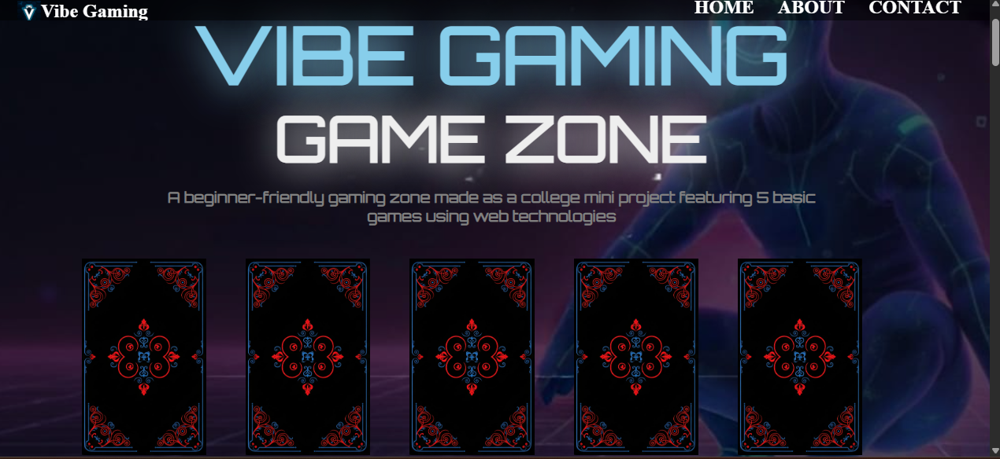
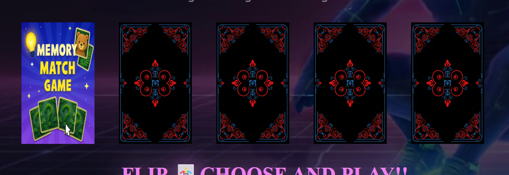
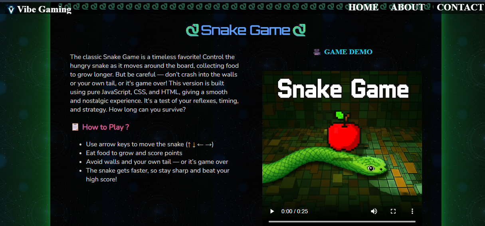
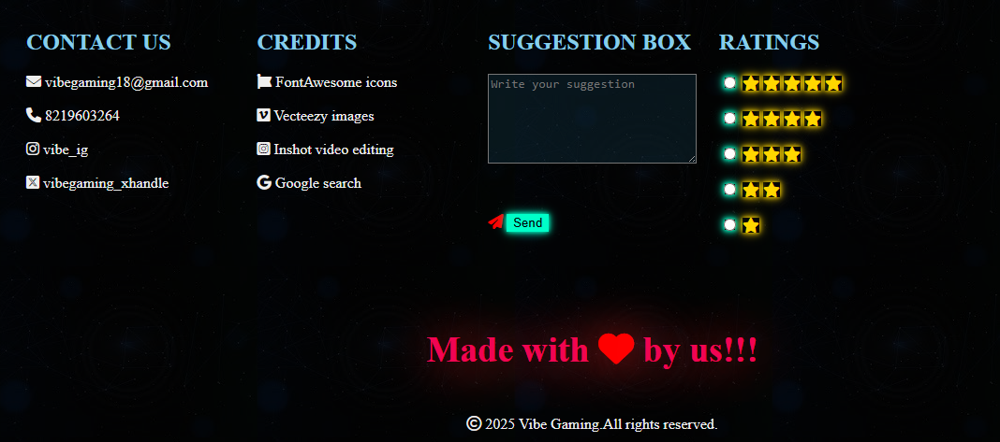
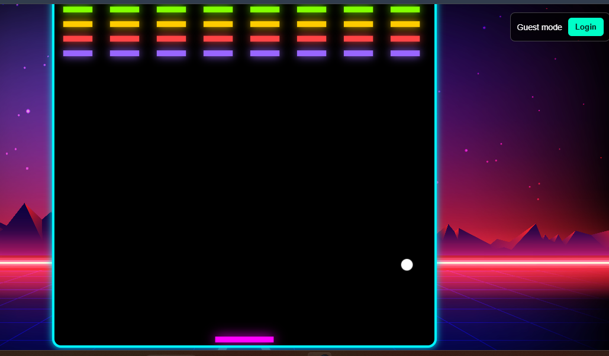
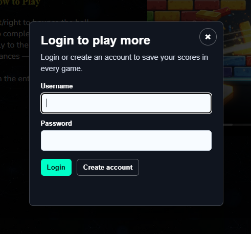
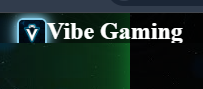

# Vibe Gaming Extended

Vibe Gaming Extended is a full-stack browser gaming zone built as a college mini project. It combines a neon arcade-style frontend with a Node.js, Express, and MySQL backend for player login, score saving, and feedback collection.

## Highlights
- Five browser games in one project: Memory Match, Rock Paper Scissors, Tic Tac Toe, Snake, and Brick Breaker.
- Login and account flow for saving game progress and scores.
- Feedback and rating section connected to the backend database.
- Responsive landing page with game previews, demo videos, contact details, and credits.
- Backend API for authentication, sessions, scores, and feedback.

## Screenshots
### Landing Page


### Game Selection Cards


### Game Detail Section


### Contact, Feedback, And Ratings


### Gameplay And Login
| Brick Breaker | Login Modal |
| --- | --- |
|  |  |

### Branding


## Tech Stack
| Layer | Technologies |
| --- | --- |
| Frontend | HTML5, CSS3, JavaScript |
| Backend | Node.js, Express.js |
| Database | MySQL / XAMPP MySQL |
| UI Assets | FontAwesome, Google Fonts, images, audio, and demo videos |

## Games
| Game | Description |
| --- | --- |
| Memory Match | Flip cards and match all pairs with the fewest moves. |
| Rock Paper Scissors | Play a quick AI-based classic game. |
| Tic Tac Toe | Two-player classic board game. |
| Snake Game | Grow the snake, avoid collisions, and beat your score. |
| Brick Breaker | Break bricks across arcade-style levels. |

## Getting Started
Install backend dependencies:

```bash
cd backend
npm install
copy .env.example .env
```

Update `backend/.env` with your MySQL settings:

```env
DB_HOST=localhost
DB_PORT=3306
DB_USER=root
DB_PASSWORD=
DB_NAME=vibe_gaming
```

Create the database:

```bash
mysql -u root -p < database.sql
```

Start the server:

```bash
npm start
```

Open the app:

```text
http://localhost:3000
```

## Project Structure
```text
.
├── backend/
│   ├── server.js
│   ├── package.json
│   ├── package-lock.json
│   ├── database.sql
│   └── .env.example
├── docs/
│   └── screenshots/
└── frontend/
    ├── index.html
    ├── about.html
    ├── project.css
    ├── game-auth.js
    ├── memory game.html
    ├── rock game.html
    ├── tic tac toe.html
    ├── snake game.html
    └── brick game.html
```

## API Routes
| Method | Route | Purpose |
| --- | --- | --- |
| GET | `/api/health` | Check server and database health. |
| POST | `/api/register` | Create a player account. |
| POST | `/api/login` | Log in and receive a session token. |
| GET | `/api/me` | Get the logged-in player. |
| POST | `/api/logout` | End the current session. |
| POST | `/api/scores` | Save a score for a game. |
| GET | `/api/scores` | Read leaderboard scores. |
| POST | `/api/feedback` | Save feedback and rating. |
| GET | `/api/feedback` | Read submitted feedback. |

## Authors
B.Tech 2nd Year Students, Jaypee Institute of Information Technology

My contribution: 

1)Frontend dashboard,Rating pannel, demo videos, games integration 

2)Backend 

## License
This project is created for educational purposes only.
